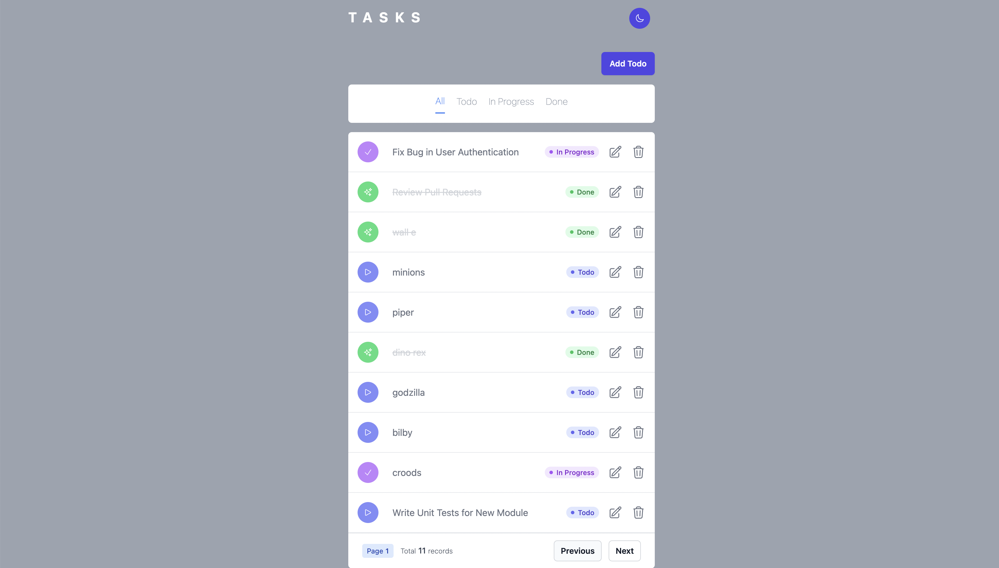
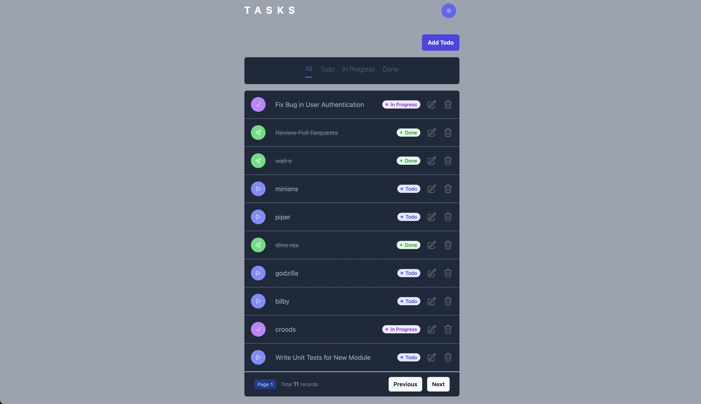
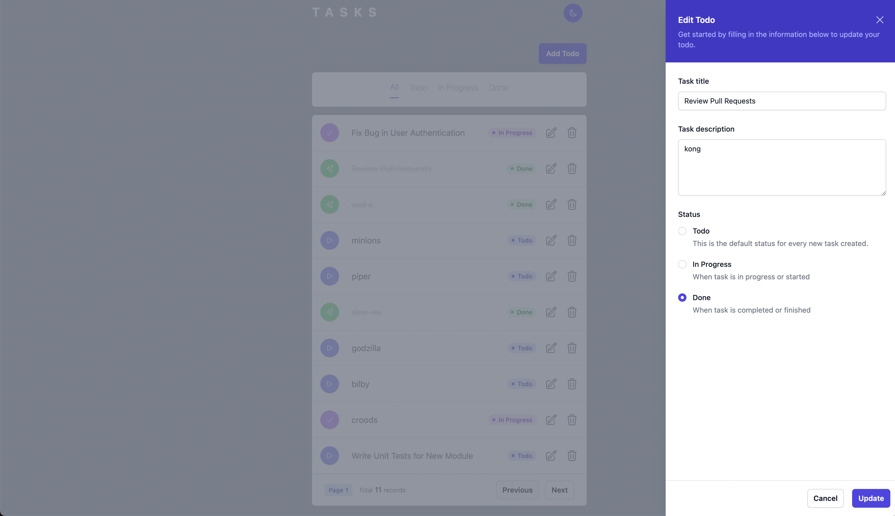
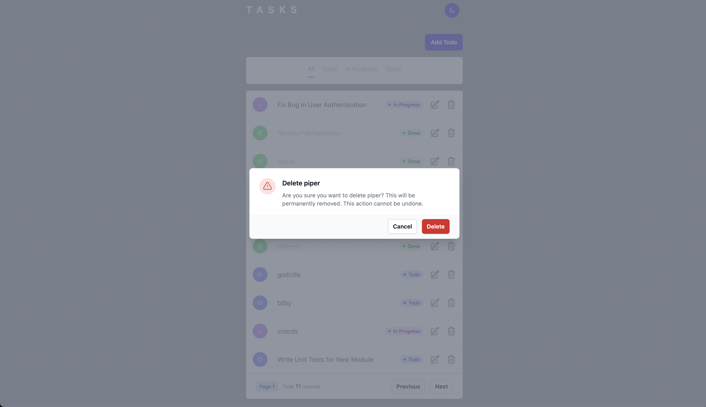
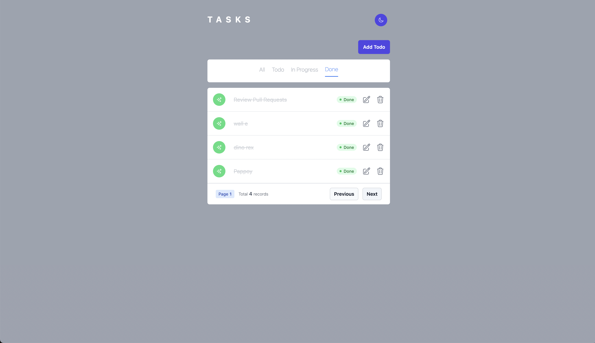
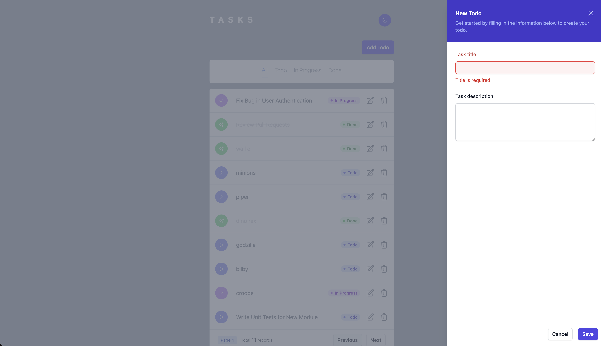

# Getting Started with Create React App

## Features

1. Create todo item
1. Update todo status to todo or in progress or completed
2. Dleete todo item
3. List todo items (filters, pagination)
4. User signup and login
5. Application authorization
6. Responsiveness
   

## App screenshots









## Setup

This project was bootstrapped with [Create React App](https://github.com/facebook/create-react-app).

### Requirements

yarn 1.22.19
node v20.11.0
playwright 1.45.0 (optional)


### Installation

```bash
yarn install
```

### `yarn start`

Runs the app in the development mode.\
Open [http://localhost:3000](http://localhost:3000) to view it in the browser.

### `yarn e2e`

End to end test framework: [Playwright](https://playwright.dev/).
This will run all e2e specs.

### `yarn build`

Builds the app for production to the `build` folder.\
It correctly bundles React in production mode and optimizes the build for the best performance.

The build is minified and the filenames include the hashes.\
Your app is ready to be deployed!

See the section about [deployment](https://facebook.github.io/create-react-app/docs/deployment) for more information.

